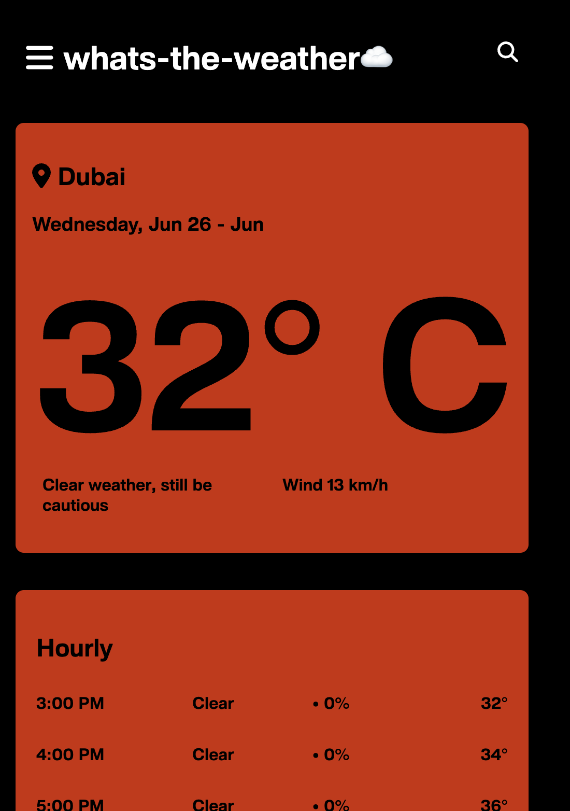

<a name="readme-top"></a>
[![Contributors][contributors-shield]][contributors-url]
[![Stargazers][stars-shield]][stars-url]
[![Issues][issues-shield]][issues-url]
[![LinkedIn][linkedin-shield]][linkedin-url]


<!-- PROJECT LOGO -->
<br />
<div align="center">
<h3 align="center">whats-the-weather</h3>

  <p align="center">
    A simple weather application using Tomorrow.io API to provide weather forecasts
    <br />
    <a href="https://github.com/benshandd/whats-the-weather"><strong>Explore the docs »</strong></a>
    <br />
    <br />
    <a href="https://whats-the-weather-rho.vercel.app/">View Demo</a>
    ·
    <a href="https://github.com/benshandd/whats-the-weather/issues/new?labels=bug&template=bug-report---.md">Report Bug</a>
    ·
    <a href="https://github.com/benshandd/whats-the-weather/issues/new?labels=enhancement&template=feature-request---.md">Request Feature</a>
  </p>
</div>


<!-- TABLE OF CONTENTS -->
<details>
  <summary>Table of Contents</summary>
  <ol>
    <li>
      <a href="#about-the-project">About The Project</a>
      <ul>
        <li><a href="#built-with">Built With</a></li>
      </ul>
    </li>
    <li>
      <a href="#getting-started">Getting Started</a>
      <ul>
        <li><a href="#prerequisites">Prerequisites</a></li>
        <li><a href="#installation">Installation</a></li>
      </ul>
    </li>
    <li><a href="#usage">Usage</a></li>
    <li><a href="#roadmap">Roadmap</a></li>
    <li><a href="#contributing">Contributing</a></li>
    <li><a href="#license">License</a></li>
    <li><a href="#contact">Contact</a></li>
    <li><a href="#acknowledgments">Acknowledgments</a></li>
  </ol>
</details>


<!-- ABOUT THE PROJECT -->
## About The Project
whats-the-weather is a simple, intuitive weather application that fetches weather data from the Tomorrow.io API. Users can search for current weather conditions, view hourly forecasts, and save their favorite locations for quick access.
<p>
<p>
<p>




<p align="right">(<a href="#readme-top">back to top</a>)</p>


### Built With
* [![node-js][node-js]][node-js]
* [![React-js][React-js]][React-js]
* [![JavaScript][JavaScript]][JavaScript-url]
* [![CSS][CSS]][CSS-url]
* [![HTML][HTML]][HTML-url]


<!-- GETTING STARTED -->
## Getting Started

To get a local copy up and running follow these simple steps.

### Prerequisites

* npm
  ```sh
  npm install npm@latest -g
  ```

### Installation

1. Get a free API Key at [Tomorrow.io](https://www.tomorrow.io/)
2. Clone the repo
   ```sh
   git clone https://github.com/benshandd/whats-the-weather.git
   ```
3. Install NPM packages
   ```sh
   npm install
   ```
4. Enter your API in `WeatherApp.js`
   ```js
     const api = {
    key: "ENTER YOUR API",
    base: "https://api.tomorrow.io/v4/",
    };
   ```

<p align="right">(<a href="#readme-top">back to top</a>)</p>


<!-- USAGE EXAMPLES -->
## Usage

To use the application, simply enter the name of the city you want to check the weather for and press enter. The application will display the current weather conditions along with an hourly forecast. You can also add locations to your favorites for easy access.

<p align="right">(<a href="#readme-top">back to top</a>)</p>


<!-- ROADMAP -->
## Roadmap

- [ ] Add more detailed weather data
- [ ] Implement daily forecasts

See the [open issues](https://github.com/benshandd/whats-the-weather/issues) for a full list of proposed features (and known issues).

<p align="right">(<a href="#readme-top">back to top</a>)</p>


<!-- CONTRIBUTING -->
## Contributing

Contributions are what make the open source community such an amazing place to learn, inspire, and create. Any contributions you make are **greatly appreciated**.

If you have a suggestion that would make this better, please fork the repo and create a pull request. You can also simply open an issue with the tag "enhancement".
Don't forget to give the project a star! Thanks again!

1. Fork the Project
2. Create your Feature Branch (`git checkout -b feature/AmazingFeature`)
3. Commit your Changes (`git commit -m 'Add some AmazingFeature'`)
4. Push to the Branch (`git push origin feature/AmazingFeature`)
5. Open a Pull Request

<p align="right">(<a href="#readme-top">back to top</a>)</p>


<!-- LICENSE -->
## License

Distributed under the MIT License. See `LICENSE.txt` for more information.

<p align="right">(<a href="#readme-top">back to top</a>)</p>


<!-- CONTACT -->
## Contact

Ben Shand - benjaminshand101@gmail.com

Project Link: [https://github.com/benshandd/whats-the-weather](https://github.com/benshandd/whats-the-weather)

<p align="right">(<a href="#readme-top">back to top</a>)</p>


<!-- ACKNOWLEDGMENTS -->
## Acknowledgments

* [Tomorrow.io](https://www.tomorrow.io/)
* [Font Awesome](https://fontawesome.com/)
* [Vercel](https://vercel.com/)

<p align="right">(<a href="#readme-top">back to top</a>)</p>

<!-- MARKDOWN LINKS & IMAGES -->
<!-- https://www.markdownguide.org/basic-syntax/#reference-style-links -->
[contributors-shield]: https://img.shields.io/github/contributors/benshandd/Ben-Shand-Portfolio.svg?style=for-the-badge
[contributors-url]: https://github.com/benshandd/Ben-Shand-Portfolio/graphs/contributors
[forks-shield]: https://img.shields.io/github/forks/benshandd/Ben-Shand-Portfolio.svg?style=for-the-badge
[forks-url]: https://github.com/benshandd/Ben-Shand-Portfolio/network/members
[stars-shield]: https://img.shields.io/github/stars/benshandd/Ben-Shand-Portfolio.svg?style=for-the-badge
[stars-url]: https://github.com/benshandd/Ben-Shand-Portfolio/stargazers
[issues-shield]: https://img.shields.io/github/issues/benshandd/Ben-Shand-Portfolio.svg?style=for-the-badge
[issues-url]: https://github.com/benshandd/Ben-Shand-Portfolio/issues
[license-shield]: https://img.shields.io/github/license/benshandd/Ben-Shand-Portfolio.svg?style=for-the-badge
[license-url]: https://github.com/benshandd/Ben-Shand-Portfolio/blob/master/LICENSE.txt
[linkedin-shield]: https://img.shields.io/badge/-LinkedIn-black.svg?style=for-the-badge&logo=linkedin&colorB=555
[linkedin-url]: https://www.linkedin.com/in/benshand/
[product-screenshot]: images/screenshot.png
[HTML]: https://img.shields.io/badge/HTML-239120?style=for-the-badge&logo=html5&logoColor=white
[HTML-url]: https://www.w3.org/html/
[CSS]: https://img.shields.io/badge/CSS-1572B6?style=for-the-badge&logo=css3&logoColor=white
[CSS-url]: https://www.w3.org/Style/CSS/Overview.en.html
[JavaScript]: https://img.shields.io/badge/JavaScript-323330?style=for-the-badge&logo=javascript&logoColor=F7DF1E
[JavaScript-url]: https://developer.mozilla.org/en-US/docs/Web/JavaScript
[React-js]: https://img.shields.io/badge/-ReactJs-61DAFB?logo=react&logoColor=white&style=for-the-badge
[node-js]: https://img.shields.io/badge/Node.js-43853D?style=for-the-badge&logo=node.js&logoColor=white
